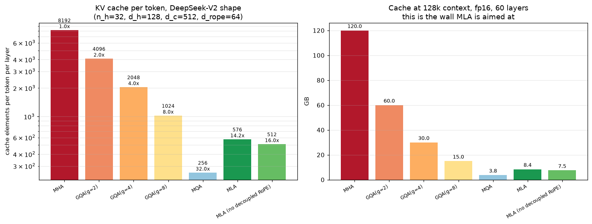
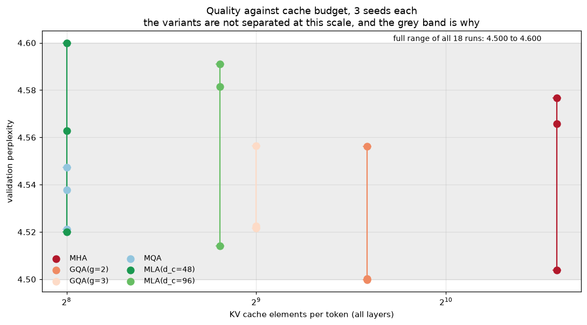
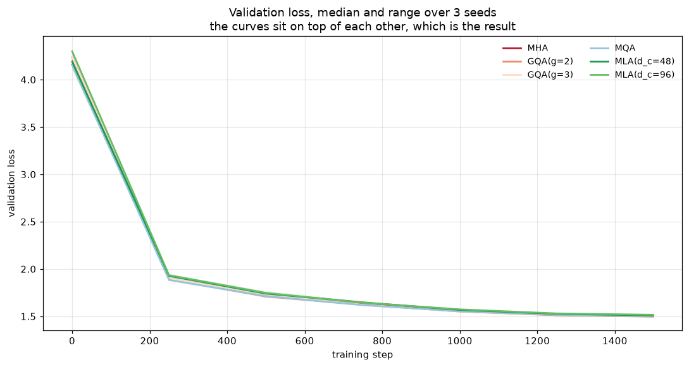

# mla-from-scratch

Multi head latent attention, built from the DeepSeek V2 paper. Low rank KV
compression, decoupled RoPE, and the absorption trick that lets inference skip
reconstructing keys and values entirely.

Two results here, and they are of very different strength. The cache accounting
is exact and large. The quality comparison is a null, and I think the honest
reading is that my experiment is too small to see the effect rather than that
the effect is absent.

## The problem

A transformer serving long context spends most of its memory on the KV cache,
not on weights. At 128k context a 60 layer model with 32 heads of width 128
needs 120 GB of cache in fp16. That is the wall.

GQA and MQA answer by sharing KV heads. Fewer heads, less cache, some quality
loss. MLA answers differently: project K and V jointly down to one small latent
vector per token, cache only that, and fold the up projections into the
neighbouring weight matrices so inference never decompresses.



| variant | elements/token/layer | vs MHA | GB at 128k, fp16, 60 layers |
|---|---:|---:|---:|
| MHA | 8192 | 1.00x | 120.00 |
| GQA(g=2) | 4096 | 2.00x | 60.00 |
| GQA(g=4) | 2048 | 4.00x | 30.00 |
| GQA(g=8) | 1024 | 8.00x | 15.00 |
| MQA | 256 | 32.00x | 3.75 |
| **MLA** | **576** | **14.22x** | **8.44** |
| MLA without decoupled RoPE | 512 | 16.00x | 7.50 |

These are arithmetic, not measurements, so there is no error bar. MLA is
`d_c + d_rope = 512 + 64`.

The last row is the price of decoupled RoPE: 64 extra elements per token, 0.94 GB
at 128k context, which buys the ability to absorb the up projections at all. It
is not a variant you would deploy, since without decoupled RoPE you have to
reconstruct every key at every step and the whole point is lost. It is in the
table because the cost of the fix is worth knowing.

MQA is smaller still, which is the point of the quality question below: MQA
already gives you 32x, so MLA only earns its complexity if it holds quality
better at the same budget.

## Absorption, and why RoPE breaks it

MLA caches `c_n = W_DKV x_n` and reconstructs `k_n = W_UK c_n`. The content
score is

    q_m . k_n = (W_Q x_m) . (W_UK c_n) = x_m^T W_Q^T W_UK c_n

so `W_UK` can be folded into `W_Q` once, and `k_n` never has to exist. The same
works on the value side: attending over the latents and up projecting once at
the end lets `W_UV` fold into `W_O`. Both are just associativity.

RoPE ruins it. Rotary embeddings put a position dependent rotation between the
two matrices,

    q_m^T R_(n-m) W_UK c_n

and `R` depends on the token index, so there is no fixed matrix to pre multiply.
Decoupled RoPE is the fix: carry a small set of extra channels that are not
compressed, apply RoPE only there, and leave the compressed path rotation free.
The score becomes a sum of an absorbed content term and a small positional term.

This repo implements both, and `AbsorbedMLA` refuses to construct itself from a
model that does not use decoupled RoPE rather than silently folding something
wrong.

**The check that matters:** absorbed inference is asserted to be numerically
identical to the naive form, across three latent widths and three sequence
lengths including 1. Measured agreement is 6e-07 max absolute difference. If the
folding were wrong both versions would still produce plausible attention output,
so this test is the only thing that can catch it.

## Quality at matched budget, and why this part is weak

Six variants, same depth, width, data, batch, steps and seed, only the attention
module changing. Character level Shakespeare, 4 layers, 192 wide, 1500 steps,
3 seeds each. 32 minutes on a laptop CPU.

| variant | cache/token | vs MHA | val perplexity | range over seeds |
|---|---:|---:|---:|---|
| MHA | 1536 | 1.0x | 4.566 | 4.504 to 4.577 |
| GQA(g=2) | 768 | 2.0x | 4.500 | 4.500 to 4.556 |
| GQA(g=3) | 512 | 3.0x | 4.523 | 4.522 to 4.556 |
| MQA | 256 | 6.0x | 4.538 | 4.521 to 4.547 |
| MLA(d_c=48) | 256 | 6.0x | 4.563 | 4.520 to 4.600 |
| MLA(d_c=96) | 448 | 3.4x | 4.581 | 4.514 to 4.591 |



**Nothing is separated.** The spread between variant medians is 0.081. The mean
spread between seeds of the same variant is 0.058. The ratio is 1.41, which is
not enough to call anything. Every one of the 18 runs lands between 4.500 and
4.600.

At matched budget, MQA scores 4.538 and MLA 4.563, a difference of 0.025 while
MLA's own seeds span 0.080. So the comparison the whole repo exists to make
comes out as a shrug.



I am not going to dress this up. Reading it as "cache design does not matter"
would be wrong in the other direction: the model is 1.7M parameters on 1M
characters of one play, and the differences between attention variants are known
to appear with scale and long context, neither of which this has. MHA has six
times the cache of MQA here and cannot beat it either, which is the clearest
sign that the experiment, not the method, is the limiting factor.

What it would take to make this comparison real: a model large enough that the
KV bottleneck binds, a context long enough that retrieval over distance matters,
and enough steps that 0.02 perplexity is outside seed noise. That is a GPU
project, and this machine does not have one.

## What I got wrong

**I assumed the quality experiment would show something.** I built the whole
matched budget comparison before checking whether the setup had the resolution
to detect the effect. The right order was to estimate seed noise first, then
decide how large the model had to be for the expected difference to clear it.
Instead I have 32 minutes of CPU time and a table where the error bars swallow
the signal. The cache accounting, which cost about ten minutes and is exact, is
the part worth reading.

**I nearly shipped absorption without the equality test.** `AbsorbedMLA` produced
sensible looking output from the start. It was only when I asserted it against
the naive path that I had any reason to believe the einsum index order was
right, and the first version was not.

## Running it

```bash
python -m venv .venv && source .venv/bin/activate
pip install -r requirements.txt
```

```bash
python -m pytest tests/ -q
```

```bash
python -m bench.cache
```

```bash
python -m train.run --steps 1500 --seeds 0 1 2
```

```bash
python -m bench.figures
```

The training sweep takes about 32 minutes on an M4 CPU. `bench.cache` is instant
because it is arithmetic. Figures read the committed CSVs and never re measure.

## Layout

```
mla/rope.py        RoPE, and the explanation of why it breaks absorption
mla/baselines.py   MHA, GQA and MQA behind one module
mla/naive.py       MLA with K and V materialised, written to be legible
mla/absorbed.py    MLA with the up projections folded away, asserted equal to naive
bench/cache.py     exact cache accounting
train/             the small char LM and the matched budget sweep
tests/             26 tests
```

## Sources

- **DeepSeek-AI. DeepSeek-V2: A Strong, Economical, and Efficient Mixture-of-Experts Language Model. 2024.** [arXiv:2405.04434](https://arxiv.org/abs/2405.04434) MLA, decoupled RoPE, and the absorption argument. Section 2.1 is the load bearing part.
- **Su, Lu, Pan, Murtadha, Wen, Liu. RoFormer: Enhanced Transformer with Rotary Position Embedding. 2021.** [arXiv:2104.09864](https://arxiv.org/abs/2104.09864) RoPE itself, and the relative position property tested here.
- **Shazeer. Fast Transformer Decoding: One Write-Head is All You Need. 2019.** [arXiv:1911.02150](https://arxiv.org/abs/1911.02150) MQA.
- **Ainslie, Lee-Thorp, de Jong, Zemlyanskiy, Lebrón, Sanghai. GQA: Training Generalized Multi-Query Transformer Models from Multi-Head Checkpoints. EMNLP 2023.** [arXiv:2305.13245](https://arxiv.org/abs/2305.13245) GQA, and the uptraining recipe.
- **Pope, Douglas, Chowdhery et al. Efficiently Scaling Transformer Inference. MLSys 2023.** [arXiv:2211.05102](https://arxiv.org/abs/2211.05102) Why the KV cache is the serving bottleneck in the first place.
- Corpus is tiny Shakespeare, from Karpathy's char-rnn.

Related: [flash-attention-from-scratch](https://github.com/aghasalim/flash-attention-from-scratch)
attacks the same memory wall from the kernel side rather than the architecture side.

## Conventions

Shared rules in [`CONVENTIONS.md`](CONVENTIONS.md). Rule 12, report variance not
just the point estimate, is the reason the quality section says what it says.

## Author

Aghasalim Mustafazada, third year AI student at Howest, Belgium.

<p align="center">
  <a href="https://github.com/aghasalim">
    </a>
  <a href="https://www.kaggle.com/aghasalimmustafazada">
    </a>
  <a href="https://linkedin.com/in/mustafazada">
    </a>
  <a href="https://orcid.org/0009-0001-8746-4582">
    </a>
</p>

## License

MIT, see [LICENSE](LICENSE).
