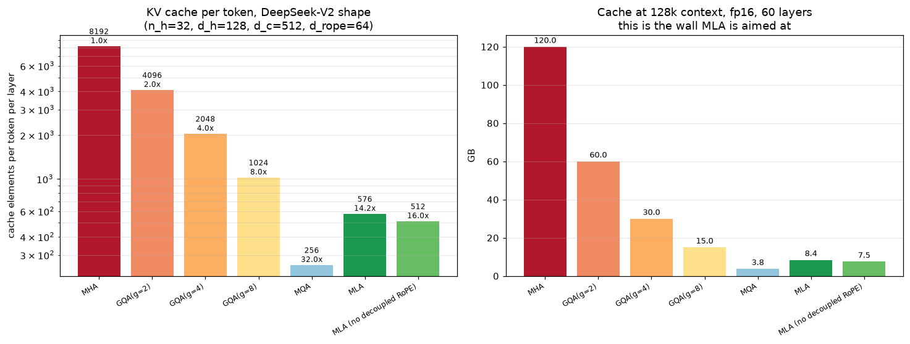
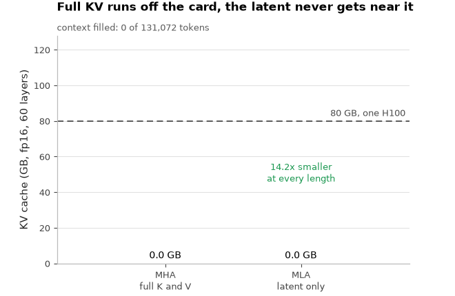
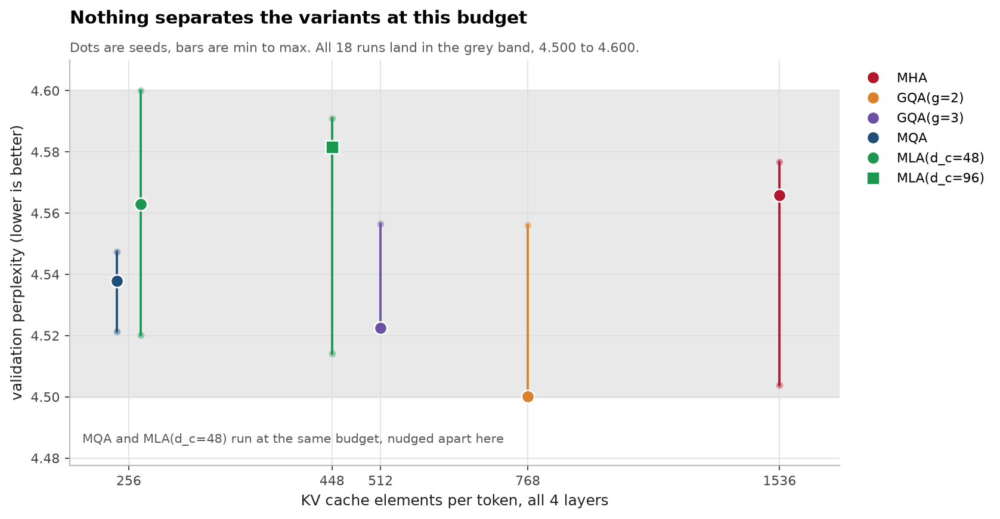
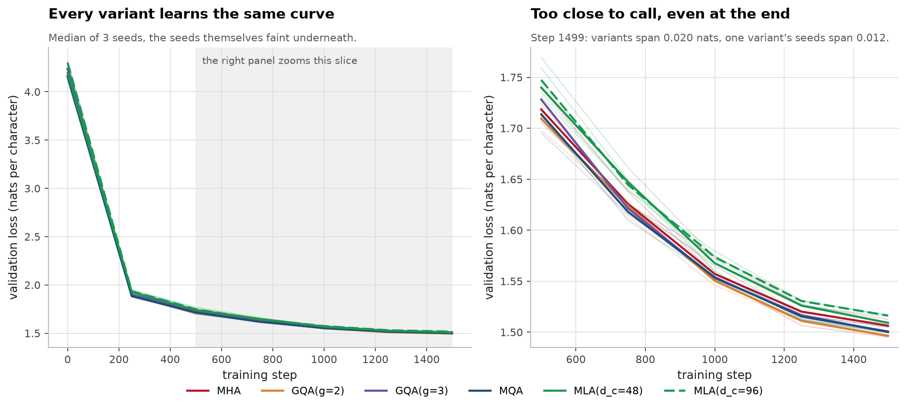

# The KV cache is the wall. MLA is one way through it.

[](https://github.com/aghasalim/mla-from-scratch/actions/workflows/ci.yml)
[](https://www.python.org/)
[](LICENSE)
[](results/)
[](https://doi.org/10.5281/zenodo.23003662)

I built multi-head latent attention from the DeepSeek V2 paper. That includes
low rank KV compression, decoupled RoPE, and the absorption trick that lets
inference skip rebuilding keys and values altogether.

I got two results, and one is much stronger than the other. The cache accounting
is exact and the savings are big. The quality comparison came out null. My read
is that my experiment was too small to see an effect, which isn't the same as
there being no effect. I don't just trust either result. Under `verify/` the
committed results and golden vectors are rebuilt from the raw shape parameters
in C, Rust, Go, R, SQL, Ruby and JavaScript, and any disagreement turns CI red.

## The problem

When a transformer serves long context, most of its memory goes to the KV cache
and not to the weights. At 128k context a 60 layer model with 32 heads of width
128 needs 120 GB of cache in fp16.

GQA and MQA deal with this by sharing KV heads. Fewer heads means less cache and
some loss in quality. MLA takes another route. It projects K and V together down
to one small latent vector per token and caches only that. The up projections
get folded into the neighbouring weight matrices, so inference never has to
decompress.



| variant | elements/token/layer | vs MHA | GB at 128k, fp16, 60 layers |
|---|---:|---:|---:|
| MHA | 8192 | 1.00x | 120.00 |
| GQA(g=2) | 4096 | 2.00x | 60.00 |
| GQA(g=4) | 2048 | 4.00x | 30.00 |
| GQA(g=8) | 1024 | 8.00x | 15.00 |
| MQA | 256 | 32.00x | 3.75 |
| **MLA** | **576** | **14.22x** | **8.44** |
| MLA without decoupled RoPE | 512 | 16.00x | 7.50 |

These are plain arithmetic, so there's no error bar. MLA is
`d_c + d_rope = 512 + 64`.

The last row shows what decoupled RoPE costs. It's 64 extra elements per token,
or 0.94 GB at 128k context, and it's what makes absorbing the up projections
possible in the first place. You wouldn't deploy that variant. Without decoupled
RoPE you have to rebuild every key at every step, which defeats the purpose. I
left it in because I wanted to know what the fix costs.

MQA is even smaller. That's why the quality question below matters. MQA already
gives you 32x, so MLA is only worth the extra complexity if it keeps quality
better at the same budget.



This is the same arithmetic as the table, animated as the context fills up. I
kept the shape fixed at the DeepSeek V2 numbers (32 heads of width 128, d_c=512,
d_rope=64, 60 layers, fp16) and only the sequence length changes. The dashed line
is one 80 GB H100.

## Absorption, and why RoPE breaks it

MLA caches `c_n = W_DKV x_n` and reconstructs `k_n = W_UK c_n`. The content
score is

    q_m . k_n = (W_Q x_m) . (W_UK c_n) = x_m^T W_Q^T W_UK c_n

so `W_UK` can be folded into `W_Q` once, and `k_n` never needs to exist. The
value side works the same way. If you attend over the latents and up project
once at the end, `W_UV` folds into `W_O`. Both follow from associativity.

RoPE breaks this. Rotary embeddings put a position dependent rotation between the
two matrices,

    q_m^T R_(n-m) W_UK c_n

and `R` depends on the token index, so there's no fixed matrix to multiply in
ahead of time. Decoupled RoPE gets around this. You keep a small set of extra
channels uncompressed, apply RoPE only to those, and leave the compressed path
without rotation. The score is then an absorbed content term plus a small
positional term.

I implemented both. `AbsorbedMLA` won't build itself from a model that doesn't
use decoupled RoPE, so it can't quietly fold the wrong thing.

The most important test checks that absorbed inference gives the same numbers as
the naive form, across three latent widths and three sequence lengths including
1. The max absolute difference is 8.3e-07, the worst case over that grid on my
laptop, and 7.7e-07 on the CI runner. That gap comes from float32 adding things
up in a different order. It isn't a bug. In double precision the two paths agree
to 3.9e-16, which the C in `verify/` measures. If the folding were wrong, both
versions would still give plausible looking attention output, so this test is
the only thing that would catch it.

## Quality at matched budget, and why this part is weak

I trained six variants with the same depth, width, data, batch, steps and seed,
changing only the attention module. They don't separate. All 18 runs land between
4.50 and 4.60 validation perplexity. The spread between variant medians is 0.081.
The mean spread between seeds of one variant is 0.058. A ratio of 1.41 isn't
enough to call anything. At the matched budget of 256 elements per token MQA
scores 4.538 and MLA 4.563. That gap is 0.025, while MLA's own three seeds span
0.080. MHA has six times the cache of MQA and still can't beat it, which tells me
the experiment is what's limiting here, more than the method.




Full detail in [notes/METHODS.md](notes/METHODS.md#quality-at-matched-budget-and-why-this-part-is-weak).

## Two things I got wrong

I assumed the quality experiment would show something. I built the whole matched
budget comparison before checking if the setup could even detect the effect.
Measuring seed noise first would have taken about ten minutes. It would have shown
me that 0.058 of noise hides the 0.025 gap I was looking for. Instead the 32
minute sweep went into a table that can't answer its own question.

I also nearly shipped `AbsorbedMLA` without an equality test against the naive
path. It gave sensible looking attention from the first run, and the einsum index
order in that first version was wrong.

I wrote up both mistakes in more detail in
[notes/METHODS.md](notes/METHODS.md#what-i-got-wrong).

## Reproducing this

```bash
python -m venv .venv && source .venv/bin/activate
pip install -r requirements.txt
```

```bash
python -m pytest tests/ -q
```

```bash
python -m bench.cache
```

```bash
python -m train.run --steps 1500 --seeds 0 1 2
```

```bash
python -m bench.figures
```

The training sweep takes about 32 minutes on an M4 CPU. `bench.cache` is instant
because it's just arithmetic. The figures read the committed CSVs and never
re measure. The config for the 18 runs is in [notes/RECIPE.md](notes/RECIPE.md).

## Where things live

```
mla/rope.py        RoPE, and the explanation of why it breaks absorption
mla/baselines.py   MHA, GQA and MQA behind one module
mla/naive.py       MLA with K and V materialised, written to be legible
mla/absorbed.py    MLA with the up projections folded away, asserted equal to naive
bench/cache.py     exact cache accounting
train/             the small char LM and the matched budget sweep
tests/             26 tests
verify/            seven other languages, arriving at the same numbers
```

## Papers

- **DeepSeek-AI. DeepSeek-V2: A Strong, Economical, and Efficient Mixture-of-Experts Language Model. 2024.** [arXiv:2405.04434](https://arxiv.org/abs/2405.04434) MLA, decoupled RoPE, and the absorption argument. Section 2.1 is the load bearing part.
- **Su, Lu, Pan, Murtadha, Wen, Liu. RoFormer: Enhanced Transformer with Rotary Position Embedding. 2021.** [arXiv:2104.09864](https://arxiv.org/abs/2104.09864) RoPE itself, and the relative position property tested here.
- **Shazeer. Fast Transformer Decoding: One Write-Head is All You Need. 2019.** [arXiv:1911.02150](https://arxiv.org/abs/1911.02150) MQA.
- **Ainslie, Lee-Thorp, de Jong, Zemlyanskiy, Lebrón, Sanghai. GQA: Training Generalized Multi-Query Transformer Models from Multi-Head Checkpoints. EMNLP 2023.** [arXiv:2305.13245](https://arxiv.org/abs/2305.13245) GQA, and the uptraining recipe.
- **Pope, Douglas, Chowdhery et al. Efficiently Scaling Transformer Inference. MLSys 2023.** [arXiv:2211.05102](https://arxiv.org/abs/2211.05102) Why the KV cache is the serving bottleneck in the first place.
- Corpus is tiny Shakespeare, from Karpathy's char-rnn.

Related: in [flash-attention-from-scratch](https://github.com/aghasalim/flash-attention-from-scratch)
I go after the same memory problem from the kernel side.

## Methodology

[`METHODOLOGY.md`](METHODOLOGY.md) has the rules I follow. Rule 10 matters most
here. It says to report the spread along with the point estimate. Once I did that,
I had to call the quality table a null, and that's what the section above does.

## License

MIT. Full text in [LICENSE](LICENSE).
